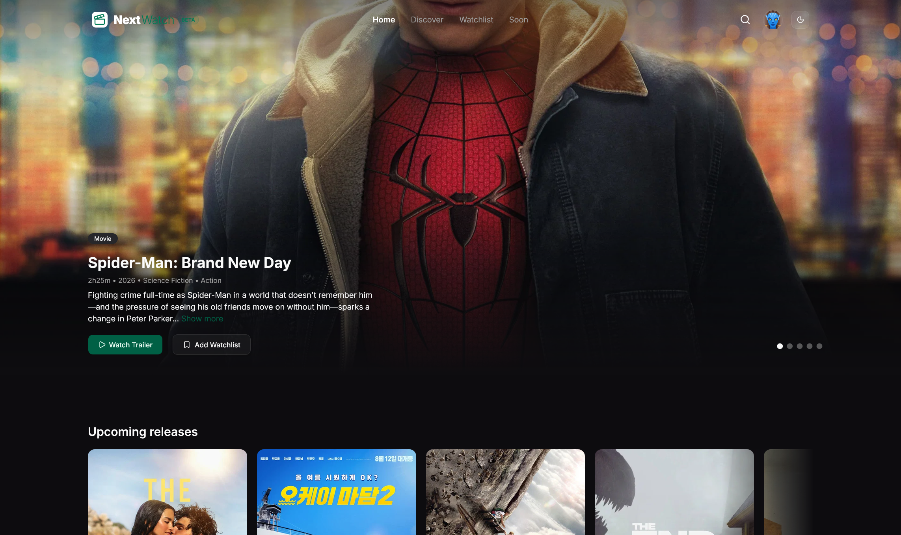
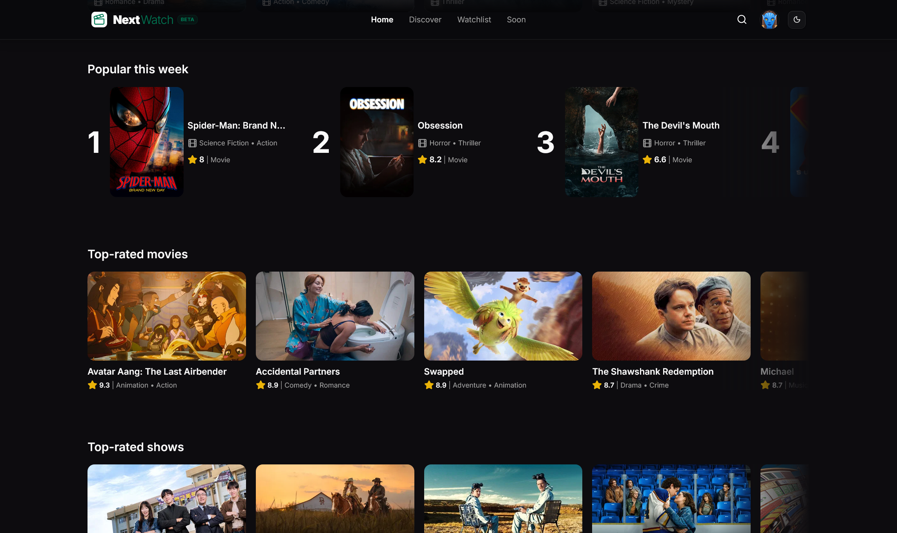
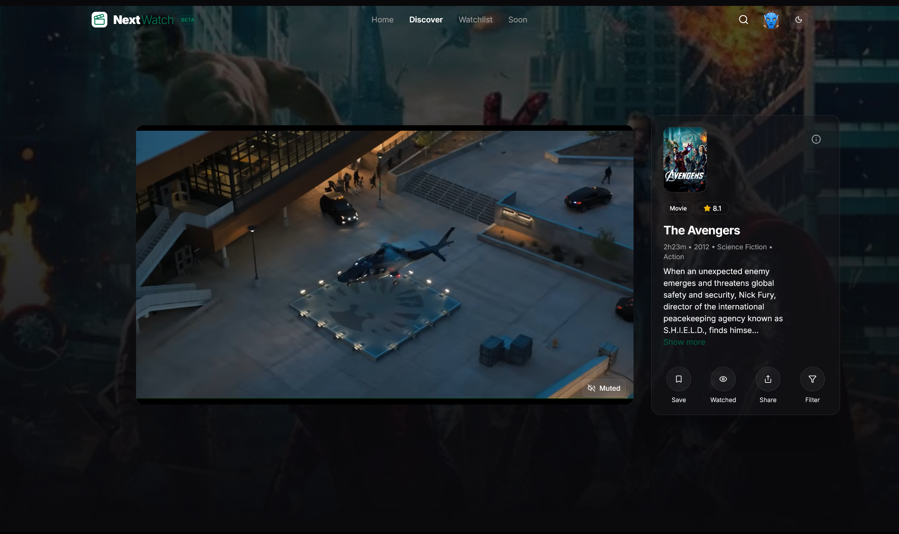
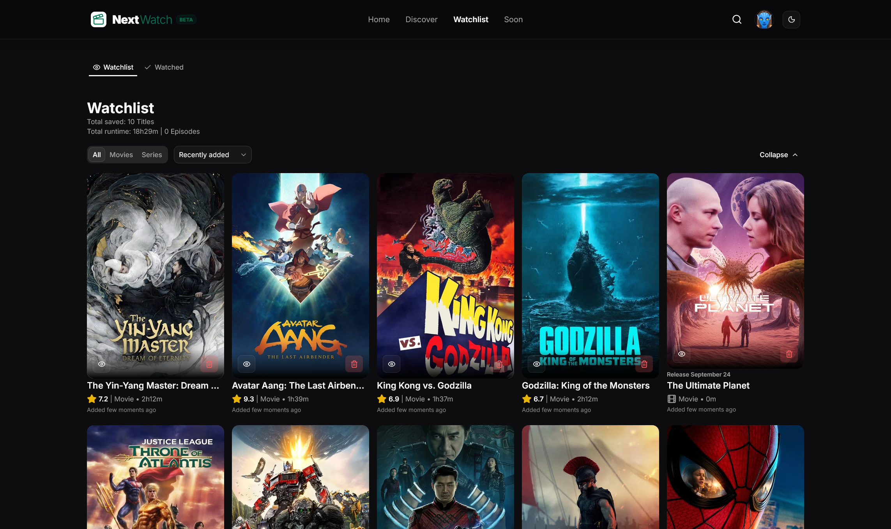
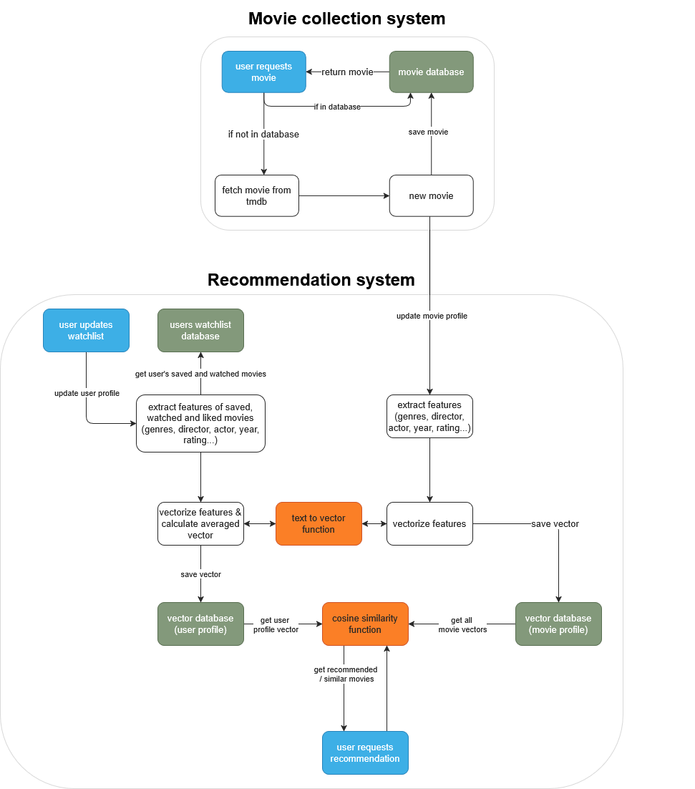
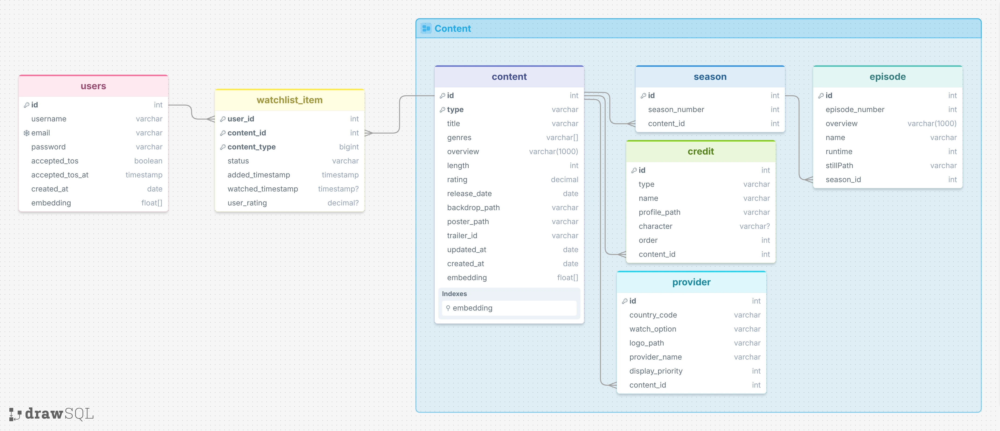

# NextWatch

A full-stack movie and TV series discovery platform built with **Next.js** and **Spring Boot**. The application provides
personalized content recommendations, user-specific watchlists, ratings, search functionality, and streaming
availability information.

**Live Demo:** [Visit NextWatch](https://nextwatch.me)

## Screenshots

  
  

  
  

## Architecture

The application consists of a Next.js frontend, a Spring Boot REST API, and a PostgreSQL database.

The frontend communicates with the backend through authenticated REST endpoints. Spring Security handles authentication
and authorization using JWT access tokens. PostgreSQL stores user-related data, while `pgvector` is used for vector
similarity searches in the recommendation system.

Movie and TV series metadata is sourced from the [TMDB](https://www.themoviedb.org) API.

## Features

* JWT-based authentication, and authorization
* User profiles and protected user-specific resources
* Watchlist and watched-content management
* Movie and TV series ratings
* Search and filtering
* New releases, popular titles, and top-rated content
* Personalized TikTok-style discovery feed
* Content-based recommendations
* Streaming, rental, and purchase availability

## Tech Stack

| Layer        | Technologies                                    |
|--------------|-------------------------------------------------|
| Frontend     | Next.js 16, TypeScript, Tailwind CSS, shadcn/ui |
| Backend      | Spring Boot, Spring Security, REST API, JWT     |
| Database     | PostgreSQL, pgvector                            |
| Embeddings   | Ollama, `nomic-embed-text`                      |
| External API | TMDB API                                        |
| Deployment   | Docker, Coolify, Netcup VPS                     |
| Analytics    | PostHog                                         |

## Recommendation System

The recommendation system uses a content-based approach based on movie and TV series metadata.

The following fields are used to generate embeddings:

* Title
* Genres
* Content type (`movie` or `series`)
* Description

The metadata is converted into vector embeddings using the `nomic-embed-text` embedding model via Ollama.. The
embeddings are stored in PostgreSQL using the `pgvector` extension.

Recommendations are generated through cosine similarity searches. User interactions, including watchlist entries and
watched content, are used as input to identify similar movies and TV series.

More than **120,000 movies and TV series** have been processed and embedded for the recommendation system.

## Database

PostgreSQL is used for relational application data, including:

* Users and authentication-related data
* Watchlists
* Watched content
* Ratings
* Movie and TV series metadata
* Vector embeddings used by the recommendation system

The `pgvector` extension enables similarity searches directly within PostgreSQL.

## Deployment

The application is containerized using Docker Compose and deployed on a Netcup VPS. Deployment and service management
are handled through Coolify.

## Planned Improvements

* Caching and performance optimizations
* Additional recommendation parameters and user signals
* API rate limiting
* OAuth 2.0 authentication
* Backend refactoring
* Database-first content retrieval
* Skeleton loading states
* UI improvements and bug fixes
